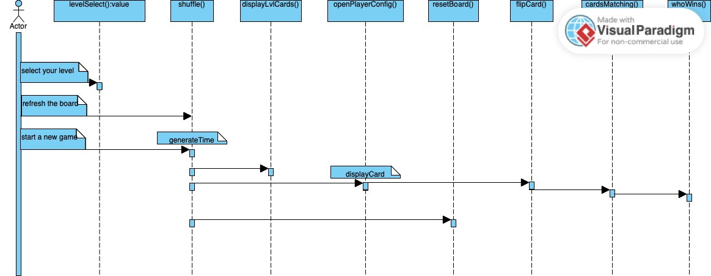

# About The Project

Memory games for kids build thinking skills, concentration, attention and persistence. In this memory game, children try to remember objects I've hidden on the other side of a card. All you need is matching two images of fruit or vegtable.

# Build Using

**- Integrated Development Environment (IDE)**

 

**- Programming Languages**

     

# Usage

A Simple diagram for work flow

# Roadmap

A full list of proposed features
- [x] Release different levels 
- [x] Display a score
- [x] Generate a timer
- [x] Feedback the player in either win or lose state

# Contribution

If you have a suggestion that would make this better, please fork the repo and create a pull request. You can also simply open an issue with the tag "enhancement". Don't forget to give the project a star! Thanks again!

1. Fork the Project
2. Create your Feature Branch (git checkout -b feature/AmazingFeature)
3. Commit your Changes (git commit -m 'Add some AmazingFeature')
4. Push to the Branch (git push origin feature/AmazingFeature)
5. Open a Pull Request

# Contact

I am Niveen, MERN developer and 

<a href="https://niveen-abdelaatty.github.io/JS-Memory-Game/" target="_blank">You can visit my game by hitting this link</a>

# Acknowledgments

I've included a few of helpful resources to kick things off!

[- MDN Web Docs](https://developer.mozilla.org/en-US/docs/Web/API/HTML_DOM_API)

[- Drawing UML-Sequence Diagram](https://online.visual-paradigm.com/diagrams/solutions/free-sequence-diagram-tool/)

[- A Youtub Video: Useful For Time Generator Feature](https://www.youtube.com/watch?v=dqqxkrKhfS4)

[- A Youtub Video: Useful For 3D Effect](https://www.youtube.com/watch?v=ZniVgo8U7ek)

[- Deploying to GitHub Pages](https://www.codecademy.com/article/f1-u3-github-pages)